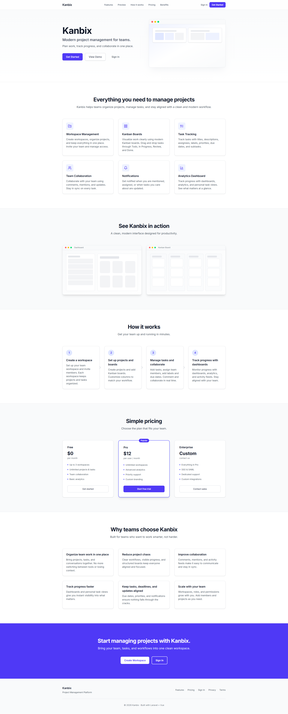
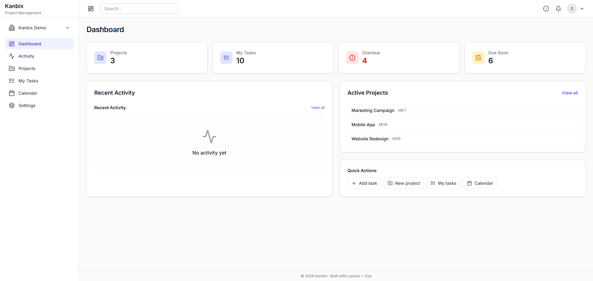
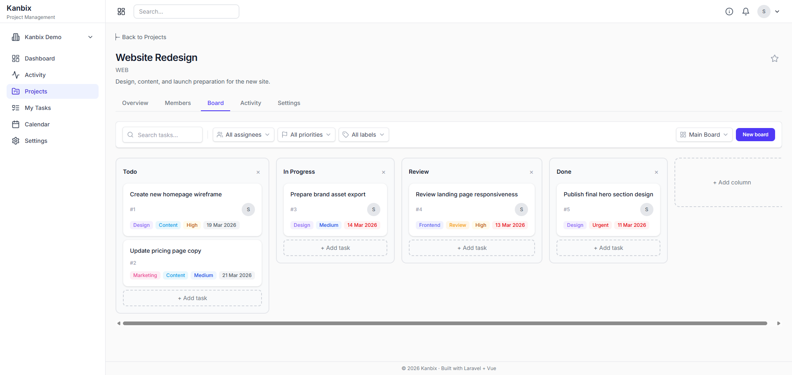
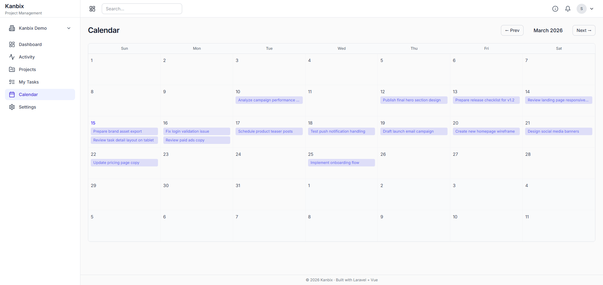
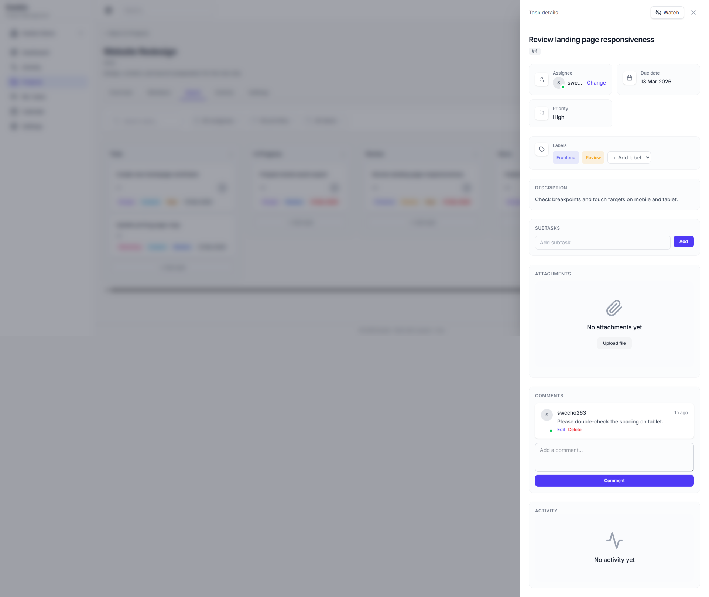
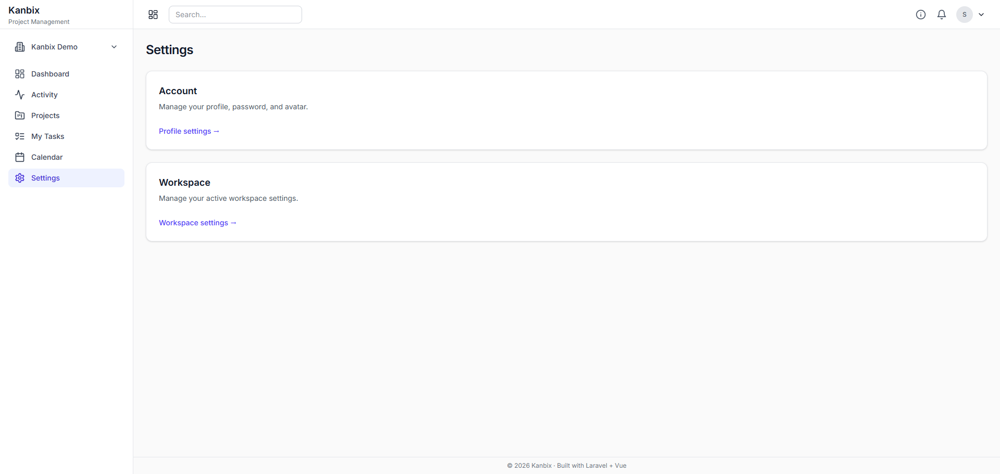

# Kanbix

**Modern project management for teams.** Plan work, track progress, and collaborate in one place.

Kanbix is a full-featured SaaS project management platform built with Laravel and Vue. It includes workspaces, Kanban boards, task tracking, comments, notifications, and workspace management—designed so recruiters and visitors can try it in seconds.

---

## Try the live demo

**[→ Live demo: https://kanbix.thethemeai.com/](https://kanbix.thethemeai.com/)** — Try the app with preloaded demo data. Use the credentials below to sign in and explore.

| | |
|---|---|
| **Email** | `demo@kanbix.example` |
| **Password** | `password` |

Sign in at the link above to open the **Kanbix Demo** workspace with sample projects, boards, and tasks. You can click through the dashboard, boards, task details, and settings.

---

## Features

| Workspaces | Boards & tasks | Collaboration |
|------------|----------------|----------------|
| Multi-tenant workspaces, roles, and members | Kanban boards, columns, drag-and-drop | Comments, mentions, file attachments |
| **Dashboard & analytics** | **Notifications & activity** | **Settings** |
| Overview, my tasks, overdue, due soon | In-app notifications, activity feeds | Workspace branding, preferences, audit log |

---

## Screenshots

| Landing | Dashboard |
|---------|-----------|
| [](screenshots/landing-1.png) | [](screenshots/dashboard-1.png) |

| Board view | Calendar |
|-------------|----------|
| [](screenshots/board-1.png) | [](screenshots/calendar-1.png) |

| Task details | Settings |
|--------------|----------|
| [](screenshots/task-details-1.png) | [](screenshots/settings-1.png) |

---

## Architecture / What I built

- **Multi-tenant workspace design** — Workspaces isolate data; every project, board, and task is scoped to a workspace. Role-based access (owner, admin, member) and workspace-level policies.
- **Auth & API** — Laravel Sanctum for API auth; register, login, password reset, and invitation-based onboarding.
- **Notifications & activity** — In-app notifications (e.g. task assigned, mentions), activity logs per task and project, and workspace audit logs for key actions.
- **Modular Laravel backend** — Services for business logic, Form Requests for validation, Policies for authorization. Separate modules for workspaces, projects, boards, tasks, comments, labels, and invitations.
- **Frontend state & UX** — Vue 3, Pinia for state (auth, workspace, UI), Vue Router. Dashboard, board view, task modals/drawers, calendar, my tasks, and workspace/project settings.

---

## Tech stack

Laravel · Vue · MySQL · Tailwind CSS · Pinia · Sanctum

---

## GitHub repository description

For portfolio visibility, set the repository description in GitHub (Settings → Description) to:

> Kanbix is a modern SaaS project management platform built with Laravel and Vue. It includes Kanban boards, tasks, collaboration tools, notifications, and workspace management.

---

# Setup (Phase 1)

1. **Install PHP dependencies**
   ```bash
   composer install
   ```

2. **Configure environment**
   ```bash
   cp .env.example .env
   php artisan key:generate
   ```
   Ensure `.env` has MySQL configured:
   ```
   DB_CONNECTION=mysql
   DB_DATABASE=saas_project_management
   DB_USERNAME=root
   DB_PASSWORD=
   ```

3. **Run migrations**
   ```bash
   php artisan migrate
   ```

4. **Install frontend dependencies**
   ```bash
   npm install
   ```

5. **Build assets**
   ```bash
   npm run build
   ```

6. **Start development**
   ```bash
   composer run dev
   ```
   Or separately: `php artisan serve` and `npm run dev`.

7. **Run tests**
   ```bash
   php artisan test
   npm run test
   ```

8. **Seed demo data** (optional, for local/demo)
   ```bash
   php artisan db:seed
   ```
   Or set `SEED_DEMO=true` in `.env` to always seed demo data. Demo includes the Kanbix Demo workspace with sample projects, boards, tasks, and more.

---

# Portfolio Summary

A production-ready **Kanbix** project management platform that helps teams organize projects, manage tasks, and collaborate efficiently.

The system allows teams to create **workspaces**, manage **projects**, organize work using **Kanban boards**, assign **tasks**, communicate through **comments**, and track activity across the entire team.

Although the system follows **SaaS architecture patterns**, it is designed to be **completely free** with **no subscription plans or feature limitations**.

This project demonstrates the ability to build a **production-ready full-stack collaboration system** using modern technologies and scalable architecture.

---

# Project Objectives

The main objective of this project is to build a **real-world team collaboration platform** that demonstrates advanced full-stack engineering skills.

The project focuses on:

• multi-tenant architecture
• collaborative task management
• scalable backend design
• modern frontend UI system
• Kanban workflow management
• activity tracking and notifications
• modular application architecture

This project is designed to simulate a **real SaaS product used by teams**, even though it does not include paid plans.

---

# Technology Stack

## Backend

* **Laravel 12**
* **PHP 8.3**
* **MySQL**
* **Redis** (queues and caching)

## Frontend

* **Vue 3**
* **Pinia** (state management)
* **Vue Router**
* **Tailwind CSS**
* **shadcn-vue UI component system**

## Infrastructure

* Redis queue workers
* REST API architecture
* modular Laravel structure
* local or cloud file storage

---

# System Architecture

The application follows a **modular architecture** where each feature area is organized into independent modules.

Major backend modules include:

* Authentication
* Workspaces
* Members
* Projects
* Boards
* Tasks
* Comments
* Files
* Notifications
* Activity Logs

Each module includes:

• models
• controllers
• services
• policies
• API routes

This architecture keeps the system **maintainable, scalable, and easy to extend**.

---

# Core System Concepts

## Workspace

A workspace represents an **organization or team**.

Examples:

• company
• startup
• agency team
• department

Each workspace contains:

* members
* projects
* boards
* tasks
* activity logs

Workspaces are **fully isolated from each other**, implementing a **multi-tenant architecture**.

---

## Members

Members are users invited into a workspace.

Members can:

• collaborate on projects
• create and manage tasks
• comment on tasks
• upload files
• receive notifications

Members can have different roles that determine their permissions.

---

## Projects

Projects represent major work initiatives inside a workspace.

Examples:

• website redesign
• mobile app development
• marketing campaign
• product launch

Each project contains:

* boards
* tasks
* project members
* activity history

---

## Boards

Boards provide a **Kanban workflow** for organizing tasks visually.

Typical columns include:

Backlog → Todo → In Progress → Review → Done

Boards allow teams to **track progress and manage workflow efficiently**.

---

## Tasks

Tasks represent individual units of work.

Each task includes:

* title
* description
* assigned members
* labels
* priority
* due date
* attachments
* comments
* column status

Tasks move between board columns as work progresses.

---

# Core Features

## Authentication System

Users can:

• register
• login
• logout
• reset passwords

Authentication uses **Laravel Sanctum**.

Features include:

* secure API authentication
* token-based sessions
* protected endpoints

---

# Workspace Management

Users can create and manage workspaces.

Features include:

• create workspace
• update workspace details
• invite members
• manage member roles
• remove members

Workspace owners control the workspace.

---

# Member Collaboration

Workspaces support team collaboration.

Features include:

* email invitations
* role assignment
* member management
* project participation

---

# Project Management

Users can create and manage projects within a workspace.

Features include:

• create project
• edit project
• archive project
• assign project members
• project descriptions and metadata

Projects organize work for teams.

---

# Kanban Board System

Each project includes a Kanban board.

Features include:

• drag-and-drop tasks
• customizable columns
• reorder columns
• reorder tasks

This allows teams to visually manage work progress.

---

# Task Management

Tasks are the central component of the platform.

Users can:

• create tasks
• edit tasks
• assign members
• add descriptions
• set due dates
• define priority
• add labels

Tasks move across board columns.

---

# Task Comments

Tasks support collaborative discussion.

Users can:

• add comments
• reply to comments
• mention users
• edit comments

This allows teams to discuss work directly within tasks.

---

# File Attachments

Tasks support file uploads.

Examples include:

* images
* documents
* screenshots
* PDFs

Files are stored using the application storage system.

---

# Activity Tracking

The system records a full **activity timeline** for projects.

Examples of tracked actions:

* task created
* task moved
* task updated
* member assigned
* comment added

Activity logs help teams understand project history.

---

# Dashboard

Each user has a dashboard displaying:

• assigned tasks
• overdue tasks
• active projects
• recent activity
• productivity statistics

The dashboard provides a quick overview of work status.

---

# Notifications

Users receive notifications for important events.

Examples include:

* task assignments
* mentions in comments
* task updates
* due date reminders

Notifications may include:

* in-app notifications
* optional email alerts

---

# Search and Filtering

Users can search and filter tasks.

Filters include:

* project
* assigned user
* due date
* task status
* labels

This helps manage large projects.

---

# Role-Based Access Control

The system supports roles:

### Owner

Full workspace control.

### Admin

Manage projects and members.

### Member

Collaborate on tasks and projects.

This ensures secure access management.

---

# User Interface System

The frontend uses **shadcn-vue**, a modern UI component system built on **Radix Vue** and **Tailwind CSS**.

This ensures:

* accessible components
* consistent UI
* customizable styling
* professional SaaS design

---

# UI Layout Structure

The application uses a **modern SaaS dashboard layout**.

Layout structure:

Sidebar Navigation
Main Content Area
Optional Right Panels

Sidebar includes:

* Dashboard
* Projects
* My Tasks
* Members
* Notifications
* Settings

The UI emphasizes **clarity, speed, and usability**.

---

# Key Frontend Pages

The main pages include:

Dashboard
Projects List
Project Board
Task Details
Members Management
Notifications
Workspace Settings
User Profile

---

# Testing

- **Backend:** PHPUnit feature and unit tests for auth, workspaces, projects, boards, tasks, comments, notifications, invitations, dashboard, profile, and workspace isolation.
- **Frontend:** Vitest component tests for Button, EmptyState, CreateProjectModal, LoginPage.
- **Philosophy:** Meaningful behavioral tests over coverage metrics; focus on authorization, validation, and workspace isolation.

```bash
php artisan test    # Backend
npm run test        # Frontend
```

---

# Scalability Considerations

The system is designed with scalability in mind.

Key practices include:

* Redis queues for background jobs
* optimized database queries
* modular backend architecture
* efficient API design
* asynchronous processing

These practices allow the system to support larger teams.

---

# Portfolio Value

This project demonstrates expertise in:

• Laravel backend engineering
• Vue frontend development
• modern UI architecture
• scalable database design
• collaboration system design
• SaaS-style architecture

It shows the ability to build a **complex real-world application used by teams**.
